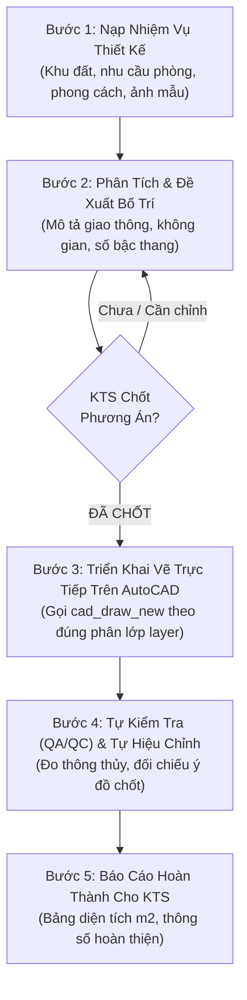
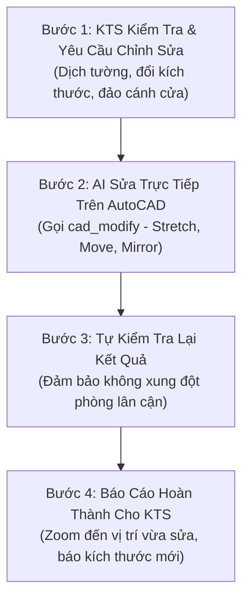

# AutoCAD AI MCP - Trợ Lý Kiến Trúc Sư Chuyên Nghiệp

[](https://github.com/jlowin/fastmcp)
[](https://www.autodesk.com/autocad)
[]()
[]()

Hệ sinh thái **Model Context Protocol (MCP)** chuyên biệt hóa dành cho **Kiến Trúc Sư & Kỹ Sư Xây Dựng**. Điều khiển và tương tác trực tiếp theo thời gian thực trên màn hình **AutoCAD (2021 - 2026)** trên cả **macOS** và **Windows**.

---

## ⚡ CÀI ĐẶT 1-CHẠM TỰ ĐỘNG TỪ GITHUB (ZERO BLOAT)

### 🍎 Dành cho máy macOS (Ở nhà):
Chạy lệnh sau trong Terminal (chỉ cài module macOS, không dính mã Windows):
```bash
curl -sSL https://raw.githubusercontent.com/YOUR_USERNAME/autocad-mcp/main/install-mac.sh | bash
```

### 🪟 Dành cho máy Windows (Tại văn phòng):
Chạy lệnh sau trong PowerShell (chỉ cài module COM ActiveX Windows):
```powershell
irm https://raw.githubusercontent.com/YOUR_USERNAME/autocad-mcp/main/install-win.ps1 | iex
```

---

## 📋 QUY TRÌNH LÀM VIỆC TIÊU CHUẨN (SOP)

Hệ thống được thiết kế vận hành theo đúng phương pháp luận làm việc của Kiến Trúc Sư:

### 🏛️ 1. QUY TRÌNH THIẾT KẾ MỚI (5 BƯỚC)



1. **Bước 1: Nạp Nhiệm Vụ Thiết Kế**: KTS cung cấp kích thước đất, số tầng, danh sách phòng, sở thích/phong cách, ảnh tham khảo (trong thư mục hoặc gửi lên chat).
2. **Bước 2: Phân Tích & Đề Xuất Phương Án**: AI phân tích và mô tả chi tiết phương án phân chia không gian, giao thông, cầu thang. **AI DỪNG LẠI CHỜ KTS CHỐT** trước khi vẽ.
3. **Bước 3: Triển Khai Vẽ Trực Tiếp**: Sau khi KTS đồng ý chốt, AI gọi `cad_draw_new` vẽ trực tiếp lên màn hình AutoCAD.
4. **Bước 4: Tự Kiểm Tra & Sửa Lỗi**: AI tự động kiểm tra kích thước thông thủy, tiêu chuẩn phòng (`cad_inspect`), phát hiện và tự sửa lỗi nếu có lệch.
5. **Bước 5: Báo Cáo Hoàn Thành**: Thông báo diện tích m2 chi tiết từng phòng cho KTS nghiệm thu.

---

### 🔧 2. QUY TRÌNH CHỈNH SỬA / HIỆU CHỈNH (4 BƯỚC)



1. **Bước 1: Tiếp Nhận Phản Hồi**: KTS kiểm tra bản vẽ trên AutoCAD và đưa ra yêu cầu (ví dụ: *"Kéo phòng khách rộng thêm 500mm"*).
2. **Bước 2: Thực Hiện Chỉnh Sửa**: AI gọi `cad_modify` để `STRETCH`, `MOVE`, `MIRROR` trực tiếp trên AutoCAD.
3. **Bước 3: Tự Kiểm Tra Lại**: Đảm bảo việc dịch chuyển không gây hẹp hành lang hoặc xung đột các phòng lân cận.
4. **Bước 4: Báo Cáo Hoàn Thành**: Zoom bản vẽ vào vị trí vừa sửa và thông báo kích thước mới cho KTS.

---

## 🏛️ TRỌN BỘ 7 LỆNH NGHIỆP VỤ CỐT LÕI

```
                  ┌─────────────────────────────────────────────────────────────┐
                  │            TRỢ LÝ AI ĐIỀU KHIỂN AUTOCAD TRỰC TIẾP           │
                  └──────────────┬───────────────────────────────┬──────────────┘
                                 │                               │
            GIAI ĐOẠN THIẾT KẾ & SỬA ĐỔI            GIAI ĐOẠN HỒ SƠ, DỰ TOÁN & IN ẤN
            ┌────────────────────────────┐          ┌────────────────────────────┐
            │ 1. ✍️ cad_draw_new         │          │ 3. 📐 cad_finalize_drawing │
            │ (Vẽ mới không gian/tường)  │          │ (Dàn trang 11 bản vẽ TKTC) │
            │                            │          │                            │
            │ 2. 🔧 cad_modify           │          │ 4. 📊 cad_estimate         │
            │ (Sửa, dịch tường, đổi cửa) │          │ (Bóc dự toán chi tiết Excel│
            └────────────────────────────┘          │                            │
                                 │                  │ 7. 🖨️ cad_plot             │
                                 │                  │ (In PDF đen trắng nét chuẩn│
                                 │                  └────────────────────────────┘
                                 ├───────────────────────────────┤
                                 │ 5. 🔍 cad_inspect (Đo đạc/lỗi)│
                                 │ 6. ⚡ cad_command (Lệnh CAD)  │
                                 └───────────────────────────────┘
```

---

### 1️⃣ `cad_draw_new` — Vẽ Mặt Bằng Kiến Trúc Mới
Vẽ trực tiếp mặt bằng lên không gian Model của AutoCAD theo đúng phân lớp layer chuẩn (`KT_TUONG_220`, `KT_TUONG_110`, `KT_CUA_DI`, `KT_THANG`, `KT_NOITHAT`).
* **Ví dụ ra lệnh**:
  > *"Vẽ mặt bằng nhà phố 5x15m gồm sân trước 2.5m, phòng khách 4.5m, thang 2.5m, bếp 4m, WC và sân sau 1.5m, có bố trí nội thất cơ bản."*

### 2️⃣ `cad_modify` — Sửa Đổi & Di Dời Linh Hoạt
Hiệu chỉnh, di dời mảng tường, co giãn kích thước phòng (`STRETCH`), đảo chiều mở cánh cửa (`MIRROR`), đổi layer trực tiếp trên màn hình.
* **Ví dụ ra lệnh**:
  > *"Kéo rộng phòng khách lùi về phía sau thêm 500mm và đổi cánh cửa phòng ngủ mở vào trong tường."*

### 3️⃣ `cad_finalize_drawing` — Hoàn Thiện Trọn Bộ Hồ Sơ Thi Công (11 Bản Vẽ Chuẩn TKTC)
Tự động hoàn thiện, phân tách và dàn trang trọn bộ **11 bản vẽ kỹ thuật thi công kiến trúc** lồng sẵn khung tên chuẩn A3 theo 5 nhóm chuyên biệt:

* **Nhóm 1: Hệ thống Mặt Bằng Các Tầng**:
  - **`KT-01` (Kích thước tường xây)**: Tắt nội thất, DIM 3 lớp (chi tiết, tim trục, phủ bì), hatch tường gạch, ghi chú tường 220/110.
  - **`KT-02` (Định vị & Ốp lát sàn)**: Tắt nội thất, ghi chú cao độ phòng (`+0.450`), đánh dấu điểm mốc lát đầu tiên, mũi tên dốc thoát sàn ($i=1.5\%$) WC/ban công.
  - **`KT-03` (Bố trí nội thất)**: Đầy đủ đồ nội thất, tag mã hiệu (`SF1`, `TV1`, `BA1`), tên phòng, diện tích thông thủy ($m^2$), bảng thống kê nội thất.
  - **`KT-04` (Định vị & Phân loại cửa)**: Lỗ mở cửa thô, tag cửa tròn `D1`, `D2`, `S1`, Bảng chỉ dẫn thông số (Rộng x Cao, Cốt bậu dưới Sill Height, Cốt lanh-tô Header Height, vật liệu).
* **Nhóm 2: Mặt Đứng & Mặt Cắt Công Trình**:
  - **`KT-05` (Mặt đứng chính công trình)**: Toàn bộ mặt tiền kiến trúc, cao độ các tầng, ban công, mái, chỉ dẫn vật liệu (đá granite, lam nhôm, sơn ngoại thất).
  - **`KT-06` (Mặt cắt dọc 1-1 qua thang)**: Cắt qua thang và giếng trời, thể hiện cấu tạo sàn, chiều cao thông thủy, lanh-tô.
* **Nhóm 3: Mặt Bằng Trần Đèn & Thoát Nước Mái**:
  - **`KT-07` (Mặt bằng Trần thạch cao & Đèn)**: Trần giật cấp, cao độ hạ trần, khe hắt LED, lưới đèn downlight D90 9W.
  - **`KT-08` (Mặt bằng Mái & Thoát nước)**: Độ dốc thoát nước mái $i=2\%$ về sê-nô, lớp chống thấm, vị trí đặt bồn nước & thái dương năng.
* **Nhóm 4: Hệ Thống Chi Tiết Kiến Trúc Chuyên Sâu**:
  - **`KT-09` (Chi tiết Cầu Thang & Lan can)**: Chi tiết mặt bậc gỗ $h=171\text{mm}, b=260\text{mm}$, mũi bậc bo tròn R10, cổ bậc ốp đá trắng, lan can kính tay vịn gỗ.
  - **`KT-10` (Chi tiết Phòng Vệ Sinh)**: Mặt bằng trích WC tỷ lệ 1/25 và mặt cắt triển khai 4 vách tường ốp lát gạch kèm cốt sen tắm, lavabo, bệt.
  - **`KT-11` (Chi tiết Cấu Tạo Cửa)**: Chi tiết cửa đi chính D1 (4 cánh), cửa sổ trượt S1 (2 cánh) kèm quy cách đố cửa & phụ kiện.

* **Ví dụ ra lệnh**:
  > *"Xuất trọn bộ 11 bản vẽ thi công kiến trúc A3 cho công trình"* (hoặc *"Xuất riêng mặt đứng chính và mặt cắt 1-1 qua thang"*).

### 4️⃣ `cad_estimate` — Bóc Tách Dự Toán Thi Công Chi Tiết (BOQ)
Tính toán khối lượng toàn diện theo định mức xây dựng Việt Nam và xuất file **Excel / CSV**:
- Bê tông móng, cột, dầm, sàn ($m^3$).
- Ván khuôn phủ phim ($m^2$).
- Cốt thép chi tiết các loại (Tấn / kg).
- Xây tường bao gạch ống 220 ($m^3$) & tường ngăn 110 ($m^2$) đã trừ diện tích cửa.
- Trát tường trong/ngoài ($m^2$), ốp lát gạch nền/WC ($m^2$), sơn bả 3 lớp ($m^2$), trần thạch cao ($m^2$), hệ thống cửa ($m^2$).
- Thiết bị điện chiếu sáng/ổ cắm, thiết bị vệ sinh cấp thoát nước.
* **Ví dụ ra lệnh**:
  > *"Lập bảng dự toán chi tiết công trình 2 tầng 5x15m cao 3.6m xuất ra file Excel du_toan.csv"*

### 5️⃣ `cad_inspect` — Kiểm Tra Diện Tích & Lỗi Bản Vẽ
Kiểm tra diện tích thông thủy, kích thước lọt lòng theo tiêu chuẩn công thái học kiến trúc và chạy lệnh Audit / Purge dọn sạch file rác.
* **Ví dụ ra lệnh**:
  > *"Kiểm tra kích thước thông thủy phòng khách và dọn rác bản vẽ."*

### 6️⃣ `cad_command` — Gửi Lệnh AutoCAD Gốc
Gửi trực tiếp các lệnh AutoCAD như `_.ZOOM _E`, `-PURGE ALL * N`, `_.REGENALL`.

### 7️⃣ `cad_plot` — In & Xuất Hồ Sơ PDF Chuẩn Nét Kỹ Thuật
In trực tiếp từ AutoCAD ra file **PDF A3/A2** với phân cấp độ dày nét chuẩn (`monochrome.ctb` in đen trắng, tường/cột $0.40\text{mm}$, nét thấy $0.20\text{mm}$, dim/trục $0.13\text{mm}$, hatch $0.09\text{mm}$):
- **In hàng loạt (`batch_all`)**: In tự động toàn bộ 11 bản vẽ `KT-01` -> `KT-11` (hoặc bộ 4 mặt bằng `KT-01` -> `KT-04`) ra các file PDF chuẩn A3 trong thư mục chỉ định.
- **In bản vẽ đơn (`single_sheet`)**: In riêng 1 bản vẽ theo mã hiệu (ví dụ `KT-01`, `KT-05`, `KT-09`).
* **Ví dụ ra lệnh**:
  > *"In hàng loạt trọn bộ 11 bản vẽ thi công ra các file PDF A3"* hoặc *"In riêng bản vẽ mặt đứng KT-05 ra file PDF"*

---

## 🔌 CẤU HÌNH VÀO AI CLIENT

### Antigravity / Claude Desktop / Cursor / VS Code:
Thêm vào file cấu hình MCP (`~/.gemini/antigravity-ide/mcp_config.json` hoặc `claude_desktop_config.json`):

#### Trên macOS:
```json
{
  "mcpServers": {
    "autocad-ai": {
      "command": "/Users/YOUR_USERNAME/.autocad_ai/venv/bin/python",
      "args": ["-m", "autocad_ai.servers.mac_server"]
    }
  }
}
```

#### Trên Windows:
```json
{
  "mcpServers": {
    "autocad-ai": {
      "command": "C:\\Users\\YOUR_USERNAME\\.autocad_ai\\venv\\Scripts\\python.exe",
      "args": ["-m", "autocad_ai.servers.win_server"]
    }
  }
}
```
