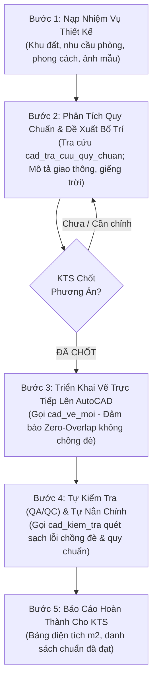
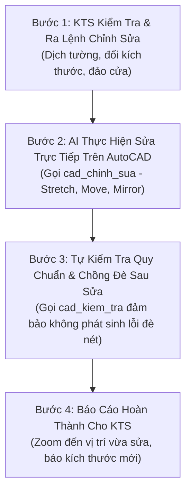

# Quy Trình Làm Việc Tiêu Chuẩn (SOP) & Bộ Quy Chuẩn Thiết Kế

Tài liệu này quy định **Cấu trúc kiểm soát quy chuẩn kiến trúc trước khi vẽ**, **Ràng buộc bản vẽ sạch sẽ - không chồng đè** và **2 Quy trình làm việc chuẩn mực (SOP)** giữa Kiến Trúc Sư và Trợ lý AI dựa trên thư viện chuẩn [architecture-reference-library](https://github.com/haianhdskt-boop/architecture-reference-library) được đóng gói trực tiếp trong mã nguồn (`autocad_ai/knowledge/`).

---

## 🚫 NGUYÊN TẮC RÀNG BUỘC BẮT BUỘC: BẢN VẼ SẠCH SẼ - KHÔNG CHỒNG ĐÈ (ZERO-OVERLAP)

AI **BẮT BUỘC** phải tuân thủ 5 nguyên tắc vệ sinh bản vẽ sau đây trong cả quá trình **VẼ MỚI (`cad_ve_moi`)**, **HOÀN THIỆN HỒ SƠ (`cad_hoan_thien_ho_so`)**, **CHỈNH SỬA (`cad_chinh_sua`)** và **KIỂM TRA (`cad_kiem_tra`)**:

```
┌─────────────────────────────────────────────────────────────────────────────┐
│             5 NGUYÊN TẮC BẢN VẼ SẠCH SẼ, MẠCH LẠC & KHÔNG CHỒNG ĐÈ          │
├───────────────────────────────────┬─────────────────────────────────────────┤
│ 1. ĐỒ NỘI THẤT - TƯỜNG XÂY        │ CẤM đồ nội thất đè/lấn vào tường xây    │
│                                   │ 110/220 (trừ hộc tủ âm tường). Giữ khe  │
│                                   │ hở an toàn >= 50 - 100mm từ mặt trong.  │
├───────────────────────────────────┼─────────────────────────────────────────┤
│ 2. TƯỜNG XÂY - ĐỒ NỘI THẤT        │ CẤM nét tường chém/đè lên thiết bị vệ   │
│                                   │ sinh, bếp, sofa, giường tủ.             │
├───────────────────────────────────┼─────────────────────────────────────────┤
│ 3. CHỮ VIẾT, GHI CHÚ & CAO ĐỘ     │ CẤM chữ ghi chú đè lên nhau. CẤM chữ đè │
│                                   │ lên nét vẽ kiến trúc, thiết bị, hatch.  │
│                                   │ Text phải đặt ở vùng đệm thoáng đãng.   │
├───────────────────────────────────┼─────────────────────────────────────────┤
│ 4. ĐƯỜNG KÍCH THƯỚC (DIM)         │ CẤM các đường DIM đè lên nhau. Phân cấp │
│                                   │ 3 tầng DIM chuẩn cách nhau >= 800mm.    │
│                                   │ Không để đường gióng cắt qua số DIM.    │
├───────────────────────────────────┼─────────────────────────────────────────┤
│ 5. ĐỘ THOÁNG & THẨM MỸ BẢN VẼ     │ Bản vẽ phải mạch lạc, phân lớp layer rõ │
│                                   │ ràng, dễ đọc cho kỹ sư & công nhân.     │
└───────────────────────────────────┴─────────────────────────────────────────┘
```

---

## 📐 BỘ QUY CHUẨN KIỂM SOÁT KIẾN TRÚC TRƯỚC KHI VẼ (PRE-DRAFTING RULES)

Trước khi đề xuất phương án, vẽ mặt bằng hoặc chỉnh sửa, AI **BẮT BUỘC** phải rà soát qua bảng ngưỡng tiêu chuẩn công thái học & kỹ thuật sau để không bao giờ vẽ sai:

```
┌─────────────────────────────────────────────────────────────────────────────┐
│               BẢNG THÔNG SỐ CÔNG THÁI HỌC & KÍCH THƯỚC TỐI THIỂU            │
├───────────────────────┬───────────────────────────────┬─────────────────────┤
│ HẠNG MỤC KHÔNG GIAN   │ KÍCH THƯỚC THÔNG THỦY TỐI THIỂU│ TIÊU CHUẨN THAM CHIẾU│
├───────────────────────┼───────────────────────────────┼─────────────────────┤
│ 1. Hành lang chính    │ Rộng >= 1100mm (phụ >= 900mm) │ Neufert & QCVN 04   │
│ 2. Cầu thang bộ       │ Vế thang >= 900mm; Chiếu nghỉ │ h = H/N (150-175mm) │
│                       │ >= 900mm; b = 250mm           │ b_hoàn thiện = 270mm│
│ 3. Lan can an toàn    │ Cao >= 900mm (vế), >= 1100mm  │ Khe hở nan đứng     │
│                       │ (thông tầng); Nan đứng <= 100mm│ an toàn trẻ em <=100│
│ 4. Phòng Khách        │ Diện tích >= 16m2; Rộng >=3.6m│ Cự ly xem TV >= 2.5m│
│ 5. Bếp & Phòng Ăn     │ Diện tích >= 12m2; Lối đi bếp │ Tam giác công năng  │
│                       │ >= 1000..1200mm; Bàn-tường 800│ Chu vi 4.0 - 7.5m   │
│ 6. Phòng Ngủ Master   │ Diện tích >= 14m2; Rộng >=3.3m│ Hở 2 bên giường 700 │
│ 7. Phòng Ngủ Đơn/Con  │ Diện tích >= 9m2; Rộng >= 2.7m│ Kê giường 1.2 - 1.4m│
│ 8. Vệ Sinh Tiêu Chuẩn │ Diện tích >= 3.2m2; Rộng >=1.4m│ Bệt hở trước >=600mm│
│                       │ Khoang tắm đứng >= 900x900mm  │ Hạ cốt sàn 30-50mm  │
│ 9. Giếng trời / Thông │ Nhà sâu >= 12m: Bắt buộc có ô │ Hiệu ứng ống khói   │
│    tầng lấy sáng      │ thang/giếng trời >= 5% sàn    │ Stack Effect        │
│ 10. Gara ô tô         │ Rộng >= 3.0m x Dài >= 5.5m    │ Độ dốc ram <= 15%   │
└───────────────────────┴───────────────────────────────┴─────────────────────┘
```

---

## 🏛️ QUY TRÌNH 1: THIẾT KẾ MẶT BẰNG MỚI (5 BƯỚC)



### Chi tiết từng bước:

#### 🔹 Bước 1: Nạp Nhiệm Vụ Thiết Kế
* **KTS cung cấp**:
  - **Quy mô & Kích thước**: Chiều rộng mặt tiền ($W$), chiều sâu khu đất ($L$), số tầng, chiều cao tầng.
  - **Nhu cầu công năng**: Danh sách các phòng (Khách, Bếp, Thang, số lượng Phòng ngủ, WC, Sân trước/sau, Giếng trời, Phòng thờ).
  - **Sở thích & Phong cách**: Hiện đại, tối giản, Indochine, phong thủy (vị trí bếp, hướng ban thờ, cung bậc thang).
  - **Tài liệu đính kèm**: Ảnh chụp hiện trạng, ảnh phối cảnh tham khảo đặt trong thư mục dự án hoặc gửi trực tiếp lên khung chat.

#### 🔹 Bước 2: Phân Tích Quy Chuẩn & Đề Xuất Phương Án (Concept Proposal)
* **AI thực hiện**:
  - Gọi công cụ **`cad_tra_cuu_quy_chuan`** để tra cứu:
    - *Mặt tiền & Sân trước*: Kích thước để xe (Gara $\ge 3.0 \times 5.5\text{m}$), khoảng lùi.
    - *Phòng khách*: Diện tích $\ge 16\text{m}^2$, bề ngang $\ge 3.6\text{m}$, cự ly xem TV $2.5 - 4.0\text{m}$.
    - *Cầu thang & Giếng trời*: Số bậc theo cung Sinh ($h = H/N$, $b=250/270\text{mm}$), ô giếng trời $\ge 5\%$ diện tích sàn tạo hiệu ứng ống khói (Stack Effect) hút gió tầng lầu.
    - *Bếp & Phòng ăn*: Tam giác công năng (Tủ lạnh - Chậu rửa - Bếp nấu) chu vi $4.0 - 7.5\text{m}$, lối đi giữa 2 dãy tủ $\ge 1.0 - 1.2\text{m}$.
    - *Phòng ngủ*: Master $\ge 14\text{m}^2$ (hở 2 bên giường $\ge 700\text{mm}$), phòng ngủ con $\ge 9\text{m}^2$.
    - *Vệ sinh*: WC 3 khu khô-ướt tách biệt $\ge 3.2\text{m}^2$, hạ cốt sàn $30 - 50\text{mm}$, độ dốc thoát nước $i = 1.5\%$.
    - *Hành lang*: Đảm bảo thông thủy $\ge 1100\text{mm}$ (hành lang chính) và $\ge 900\text{mm}$ (hành lang phụ).
  - **QUY TẮC BẮT BUỘC**: AI trình bày phương án rõ ràng để thảo luận cùng KTS và **CHỜ KTS XÁC NHẬN "CHỐT PHƯƠNG ÁN"** mới được vẽ. Không tự ý vẽ khi chưa có sự đồng thuận.

#### 🔹 Bước 3: Triển Khai Vẽ Trực Tiếp Lên AutoCAD
* **AI thực hiện**:
  - Gọi công cụ **`cad_ve_moi`** để vẽ trực tiếp từng đối tượng lên AutoCAD theo đúng phương án đã chốt.
  - **Tuân thủ quy tắc Không Chồng Đè**: Đồ nội thất nằm gọn trong lọt lòng phòng, chữ ghi chú đặt ở vùng đệm riêng không đè lên đồ đạc hay nét hatch.
  - Phân loại đúng các lớp layer chuẩn:
    - `KT_TUONG_220`: Tường bao ngoài, cột chịu lực (Màu 1 - Đỏ).
    - `KT_TUONG_110`: Tường ngăn phòng (Màu 2 - Vàng).
    - `KT_CUA_DI`: Cửa đi chính, cửa phòng, cửa WC (Màu 3 - Xanh lá).
    - `KT_CUA_SO`: Cửa sổ lấy sáng, lấy gió (Màu 4 - Cyan).
    - `KT_THANG`: Bậc thang, tim thang, mũi tên UP (Màu 5 - Blue).
    - `KT_NOITHAT`: Sofa, bàn ăn, bếp, bệt, lavabo (Màu 8 - Xám).
    - `KT_TEXT`: Tên phòng và diện tích (Màu 7 - Trắng).

#### 🔹 Bước 4: Tự Kiểm Tra (QA/QC) & Tự Hiệu Chỉnh
* **AI thực hiện**:
  - Tự động gọi **`cad_kiem_tra` (action: 'audit_full_plan')** kiểm tra:
    - **Quét chồng đè**: Xác nhận không có đồ nội thất đè vào tường, không có chữ số DIM hay ghi chú đè lên nhau.
    - **Quét thông thủy**: Rà soát kích thước lọt lòng và diện tích phòng.
    - **Quét giao thông**: Kiểm tra không có nút thắt hành lang $< 900\text{mm}$.
  - Nếu phát hiện nét hở, chữ đè hoặc phòng chưa khớp, AI **tự động nắn chỉnh sửa lại ngay** trước khi bàn giao.

#### 🔹 Bước 5: Báo Cáo Hoàn Thành Cho KTS
* **AI thực hiện**:
  - Báo cáo rõ ràng:
    - Bảng tổng hợp diện tích xây dựng và diện tích thông thủy chi tiết từng phòng.
    - Danh sách các tiêu chuẩn công thái học, độ sạch sẽ bản vẽ đã được đáp ứng.
    - Mời KTS kiểm tra thực tế trên màn hình AutoCAD.

---

## 🔧 QUY TRÌNH 2: CHỈNH SỬA & HIỆU CHỈNH BẢN VẼ (4 BƯỚC)



### Chi tiết từng bước:

#### 🔹 Bước 1: KTS Tiếp Nhận & Yêu Cầu Chỉnh Sửa
* KTS quan sát bản vẽ trên màn hình AutoCAD và đưa ra phản hồi:
  - *"Kéo phòng khách rộng thêm 500mm lùi về phía sau."*
  - *"Đảo cánh cửa phòng ngủ mở vào trong góc tường bên trái."*

#### 🔹 Bước 2: AI Thực Hiện Chỉnh Sửa Trực Tiếp
* AI phân tích đối tượng và vùng ảnh hưởng $\rightarrow$ Gọi công cụ **`cad_chinh_sua`**:
  - Dùng lệnh `STRETCH` co giãn mảng tường và không gian phòng.
  - Dùng lệnh `MOVE` di dời vị trí thiết bị nội thất / cửa.
  - Dùng lệnh `MIRROR` / `ROTATE` đảo chiều mở cửa.

#### 🔹 Bước 3: Tự Kiểm Tra Lại Kết Quả Sau Sửa (Rà Soát Xung Đột)
* AI tự động gọi **`cad_kiem_tra`**:
  - Việc nới rộng phòng này có làm **phòng bên cạnh bị bóp hẹp dưới diện tích tối thiểu** hay không.
  - Đảm bảo việc dịch chuyển tường **không đè lên đồ nội thất/thiết bị vệ sinh** đã đặt trước đó.
  - Tự động nắn chỉnh lại các đối tượng nội thất và đường Dim liên quan.

#### 🔹 Bước 4: Báo Cáo Hoàn Thành Cho KTS
* AI gửi lệnh `_.ZOOM _E` (qua `cad_gui_lenh`) hoặc zoom vào vùng vừa sửa.
* Thông báo cho KTS: Đối tượng nào đã được thay đổi, kích thước mới sau khi sửa và mời KTS nghiệm thu.
