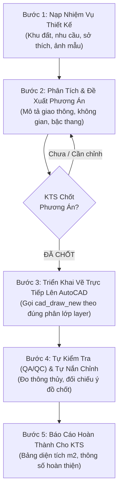
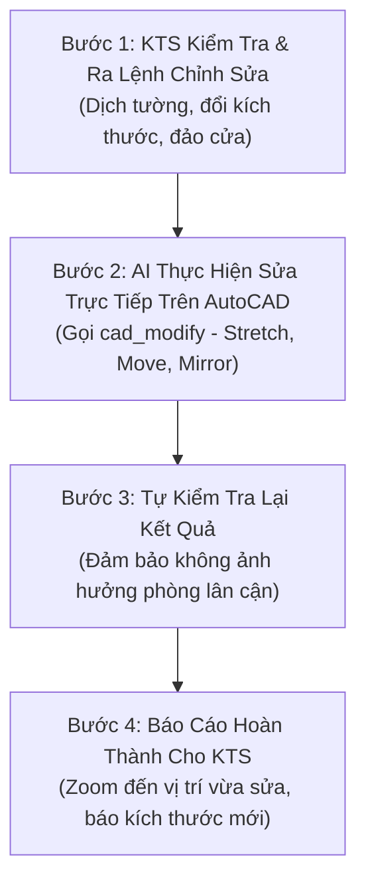

# Quy Trình Làm Việc Tiêu Chuẩn (SOP) - AutoCAD AI MCP

Tài liệu này quy định **2 Quy trình làm việc chuẩn mực** giữa Kiến Trúc Sư và Trợ lý AI khi sử dụng hệ thống `autocad-ai-mcp` để thiết kế mới và chỉnh sửa bản vẽ trực tiếp trên AutoCAD.

---

## 🏛️ QUY TRÌNH 1: THIẾT KẾ MẶT BẰNG MỚI (5 BƯỚC)

### Chi tiết từng bước:

#### 🔹 Bước 1: Nạp Nhiệm Vụ Thiết Kế
* **KTS cung cấp**:
  - **Quy mô & Kích thước**: Chiều rộng mặt tiền ($W$), chiều sâu khu đất ($L$), số tầng, chiều cao tầng.
  - **Nhu cầu công năng**: Danh sách các phòng (Khách, Bếp, Thang, số lượng Phòng ngủ, WC, Sân trước/sau, Giếng trời, Phòng thờ).
  - **Sở thích & Phong cách**: Hiện đại, tối giản, không gian mở, phong thủy (vị trí bếp, hướng ban thờ, cung bậc thang).
  - **Tài liệu đính kèm**: Ảnh chụp hiện trạng, ảnh phối cảnh tham khảo đặt trong thư mục dự án hoặc gửi trực tiếp lên khung chat.

#### 🔹 Bước 2: Phân Tích & Đề Xuất Phương Án Bố Trí (Concept Proposal)
* **AI thực hiện**:
  - Phân tích nhiệm vụ thiết kế và lập bản mô tả chi tiết phương án phân chia không gian:
    - *Mặt tiền & Sân trước*: Kích thước để xe, khoảng lùi.
    - *Phòng khách & Giao thông chính*: Vị trí, kích thước, trục hành lang.
    - *Khu vực Cầu thang & Giếng trời*: Số bậc (ví dụ 21 bậc cho tầng 3.6m), vị trí chiếu nghỉ, giải pháp lấy sáng tự nhiên.
    - *Bếp & Phòng ăn*: Vị trí đặt bếp nấu, bàn ăn, hướng thoát mùi.
    - *Khu vệ sinh & Sân sau*: Bố trí hạ cốt, chống mùi, thông gió.
  - **QUY TẮC BẮT BUỘC**: AI trình bày phương án rõ ràng để thảo luận cùng KTS và **CHỜ KTS XÁC NHẬN "CHỐT PHƯƠNG ÁN"** mới được vẽ. Không tự ý vẽ khi chưa có sự đồng thuận.

#### 🔹 Bước 3: Triển Khai Vẽ Trực Tiếp Lên AutoCAD
* **AI thực hiện**:
  - Gọi công cụ **`cad_draw_new`** để vẽ trực tiếp từng đối tượng lên không gian Model của AutoCAD theo đúng phương án đã chốt.
  - Tự động phân loại đúng các lớp layer chuẩn:
    - `KT_TUONG_220`: Tường bao ngoài, cột chịu lực (Màu 1 - Đỏ).
    - `KT_TUONG_110`: Tường ngăn phòng (Màu 2 - Vàng).
    - `KT_CUA_DI`: Cửa đi chính, cửa phòng, cửa WC (Màu 3 - Xanh lá).
    - `KT_CUA_SO`: Cửa sổ lấy sáng, lấy gió (Màu 4 - Cyan).
    - `KT_THANG`: Bậc thang, tim thang, mũi tên UP (Màu 5 - Blue).
    - `KT_NOITHAT`: Sofa, bàn ăn, bếp, bệt, lavabo (Màu 8 - Xám).
    - `KT_TEXT`: Tên phòng và diện tích (Màu 7 - Trắng).

#### 🔹 Bước 4: Tự Kiểm Tra (QA/QC) & Tự Hiệu Chỉnh
* **AI thực hiện**:
  - Tự động gọi **`cad_inspect`** kiểm tra:
    - Kích thước thông thủy từng phòng có đạt tiêu chuẩn công thái học không.
    - Chiều rộng hành lang, độ rộng lọt lòng cửa, chiều rộng vế thang.
    - Đối chiếu tọa độ các phòng trên AutoCAD với phương án đã chốt ở Bước 2.
  - Nếu phát hiện nét hở hoặc phòng chưa khớp, AI **tự động nắn chỉnh sửa lại ngay** trước khi bàn giao.

#### 🔹 Bước 5: Báo Cáo Hoàn Thành Cho KTS
* **AI thực hiện**:
  - Báo cáo rõ ràng:
    - Tóm tắt tổng diện tích xây dựng ($m^2$).
    - Bảng diện tích thông thủy chi tiết từng phòng.
    - Thông báo bản vẽ đã hiển thị hoàn chỉnh trên AutoCAD và mời KTS xem xét.

---

## 🔧 QUY TRÌNH 2: CHỈNH SỬA & HIỆU CHỈNH BẢN VẼ (4 BƯỚC)

### Chi tiết từng bước:

#### 🔹 Bước 1: KTS Tiếp Nhận & Yêu Cầu Chỉnh Sửa
* KTS quan sát bản vẽ trên màn hình AutoCAD và đưa ra phản hồi (Feedback/Redline), ví dụ:
  - *"Kéo phòng khách lùi lại phía sau 500mm để mở rộng sân trước."*
  - *"Đổi cánh cửa phòng ngủ sang mở vào phía góc tường bên trái."*
  - *"Dịch vị trí bếp sang cạnh giếng trời để hút mùi tốt hơn."*

#### 🔹 Bước 2: AI Thực Hiện Chỉnh Sửa Trực Tiếp
* AI phân tích đối tượng và vùng ảnh hưởng $\rightarrow$ Gọi công cụ **`cad_modify`**:
  - Dùng lệnh `STRETCH` co giãn mảng tường và không gian phòng.
  - Dùng lệnh `MOVE` di dời vị trí thiết bị nội thất / cửa.
  - Dùng lệnh `MIRROR` / `ROTATE` đảo chiều mở cửa.

#### 🔹 Bước 3: Tự Kiểm Tra Lại Kết Quả Sau Sửa
* AI tự động rà soát:
  - Việc dịch tường có làm hẹp lối đi hành lang hoặc phạm vào không gian phòng khác không.
  - Kiểm tra diện tích thông thủy mới của các phòng bị ảnh hưởng.
  - Tự động nắn chỉnh lại các đối tượng liên đới (ví dụ: dời tường thì dời theo đồ nội thất và Dim tương ứng).

#### 🔹 Bước 4: Báo Cáo Hoàn Thành Cho KTS
* AI gửi lệnh `_.ZOOM _E` hoặc zoom vào vùng vừa sửa.
* Thông báo cho KTS: Đối tượng nào đã được thay đổi, kích thước mới sau khi sửa và mời KTS nghiệm thu.
